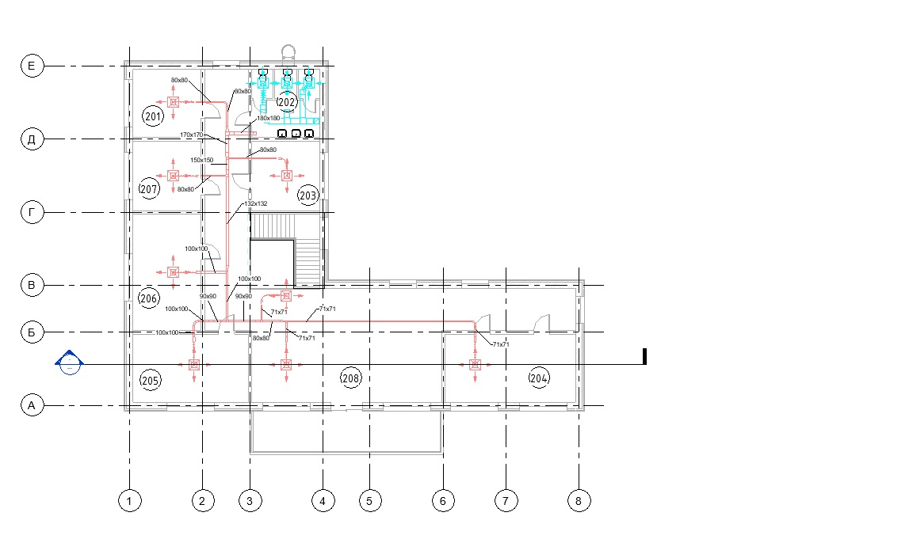

#### **Проект вентиляции офисного здания**

В данном проекте была разработана система вентиляции 2-ух этажного офисного здания.
Схемы вентиляции - приточная и вытяжная.
Архитектура подгружалась в данный проект через подложку.
Внизу представляю скрины из проекта.

_План 1 этажа_

_План 2 этажа_

_Аксонометрическая проекция В1_

_Аксонометрическая проекция П1_

_Лист с общими планами и видами_
