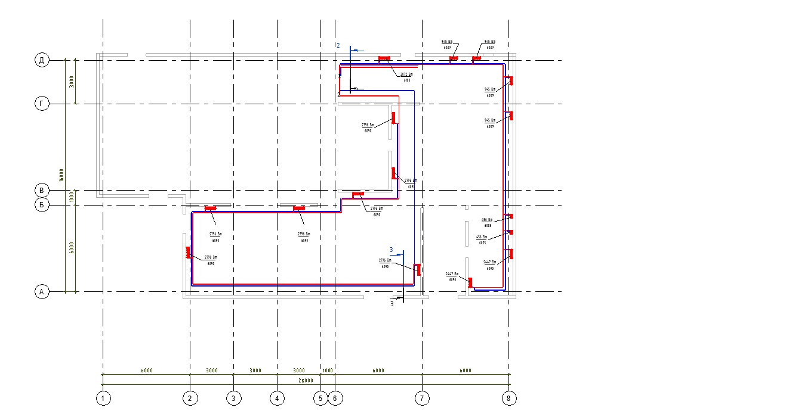
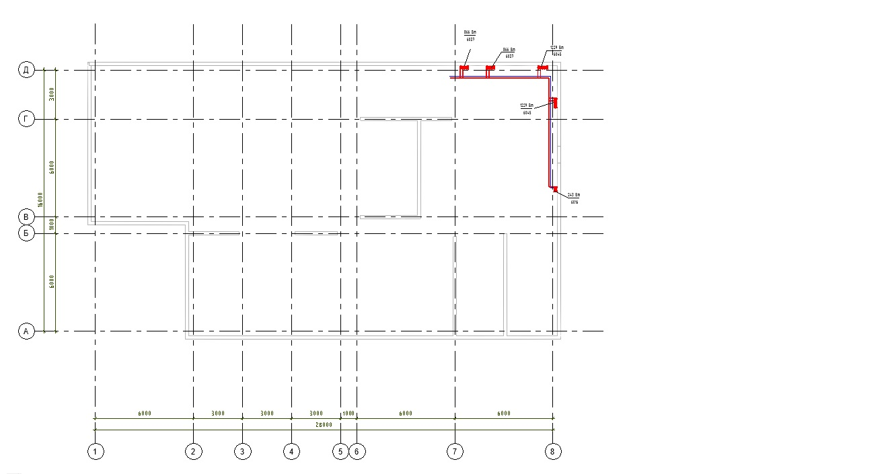
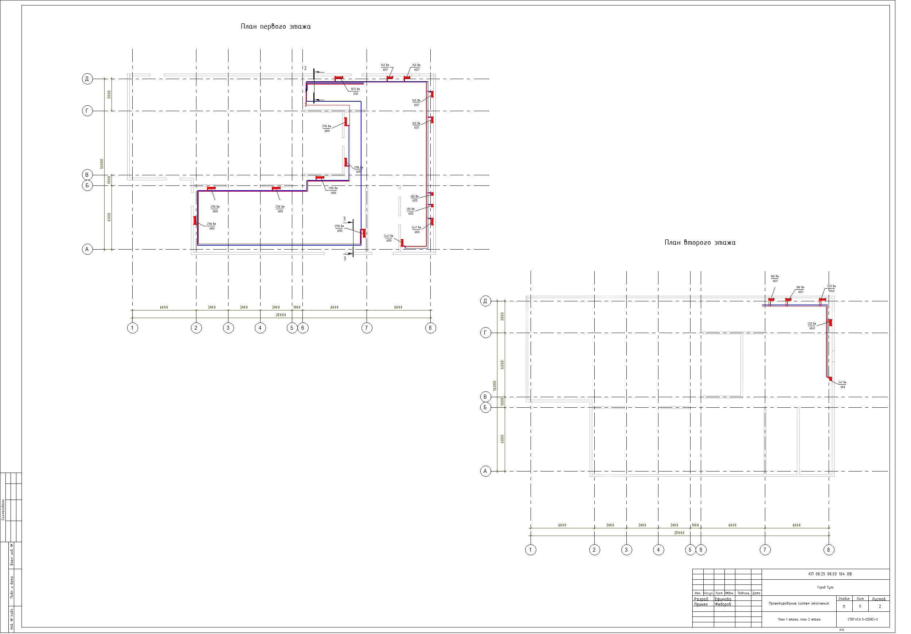
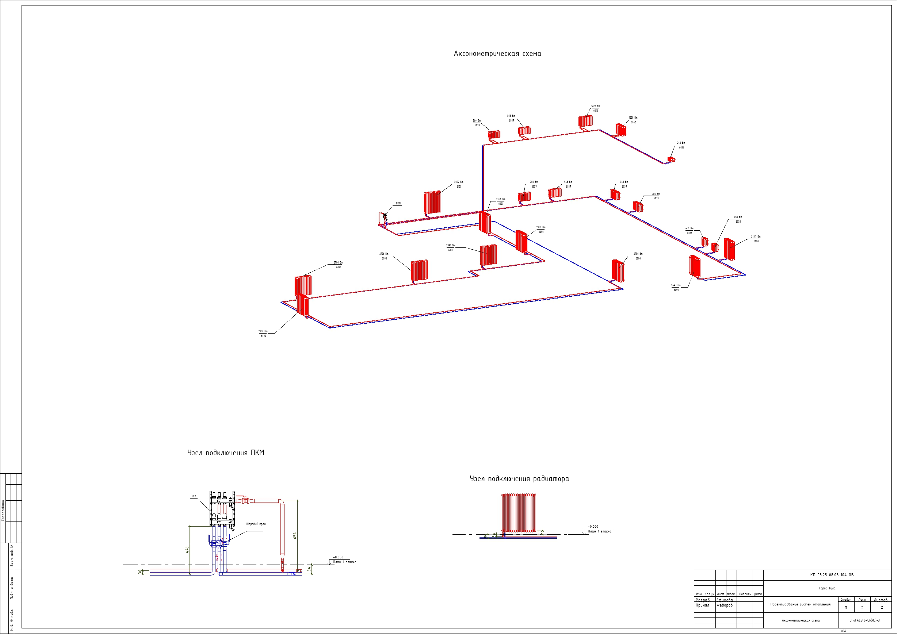

### **Проект отопления кинотеатра**

В данном проекте была разработана система отопления 2-ух этажного кинотеатра.
Схемы отопления - 2-ух трубная тупиковая, 2-ух трубная попутная, бойпас однотрубная система.
Использовала семейство трубчатых радиаторов VOGEL&NOOT. Архитектура подгружалась через подложку. 
Внизу представляю скрины из проекта.

_План 1 этажа_

_План 2 этажа_

_Лист с планами 1 и второго этажа_

_Аксонометрическая проекция 3 схем отопления(Т1, Т2, Т3), узел подключения(ПКМ,радиатора)_
